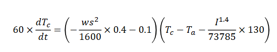
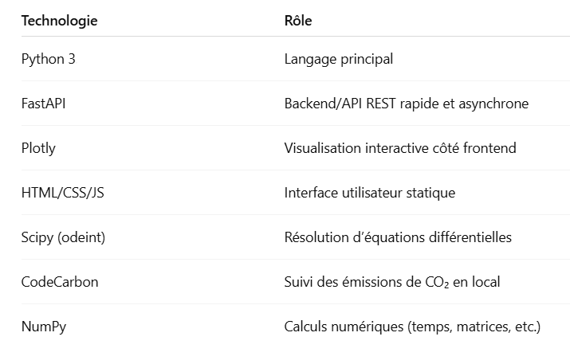

#  Documentation technique

Ce document détaille les fondements scientifiques, les choix techniques et les outils utilisés pour construire l’application de simulation thermique du câble.

---

##  1. Modèle physique utilisé

L'évolution de la température du câble est gouvernée par une **équation différentielle non linéaire** issue du département R&D :

### Signification des termes :

- `Tc` : température du câble (°C)

- `Ta` : température ambiante (°C)

- `I` : intensité du courant (en A)

- `ws` : vitesse du vent (en m/s)

Le modèle prend en compte :

- **Le refroidissement par convection naturelle** (via le vent)
- **Le réchauffement par effet Joule** (lié à l’intensité du courant)
- **L’écart thermique avec l’environnement**

---

## 2. Résolution numérique : `scipy.odeint`

Nous utilisons la méthode `odeint` du module `scipy.integrate` pour résoudre cette équation différentielle de manière efficace.

from scipy.integrate import odeint

    def dTc_dt(Tc, t, ws, Ta, I):

        A = (- (ws ** 2) / 1600) * 0.4 - 0.1

        B = (Tc - Ta - (I ** 1.4 / 73785) * 130)

        return (A * B) / 60

sol = odeint(dTc_dt, Tc0, t_minutes, args=(ws, Ta, I))

## 3. Méthode alternative : boucle for (manuelle)
Pour mieux observer l’évolution et tester des optimisations, une résolution manuelle a également été implémentée :

dt = 1e-6

while t < t_total:

    dTc = dTc_dt(Tc, t, ws, Ta, I)

    Tc += dTc * dt

    t += dt

Cette méthode consiste à avancer pas à pas avec un petit pas de temps (1 microseconde).

Inconvénients :
Moins performante (très lente)

Moins stable pour de grandes durées

Utilité :
Observer finement les variations

Comparaison avec odeint

## 4. Mesure réelle du CO₂ avec codecarbon
Nous avons intégré la librairie codecarbon pour suivre les émissions réelles de CO₂ pendant une opération simulée.

Fonction utilisée :

from codecarbon import EmissionsTracker
import numpy as np

def simulate_heavy_computation():
    tracker = EmissionsTracker()
    tracker.start()

    _ = np.random.random((10000, 10000))  # opération intensive

    emissions = tracker.stop()
    return emissions
 Ce que fait codecarbon :

- Estime le pays

- l'énergie, la configuration matérielle

- Suit la durée de calcul

- Calcule le CO₂ généré en grammes

Un fichier .csv est automatiquement généré avec :

- Timestamp, durée, énergie consommée

- Pays, CPU, RAM utilisés

- CO₂ total estimé

## 5. Technologies utilisées 

## 6. Conclusion

L'application repose sur un modèle physique rigoureux, résolu efficacement avec des outils scientifiques (scipy, numpy), et s’inscrit dans une démarche d’éco-conception numérique grâce à codecarbon.

L’interface utilisateur, couplée à une API simple, permet une simulation intuitive tout en sensibilisant à l’impact énergétique des calculs numériques.