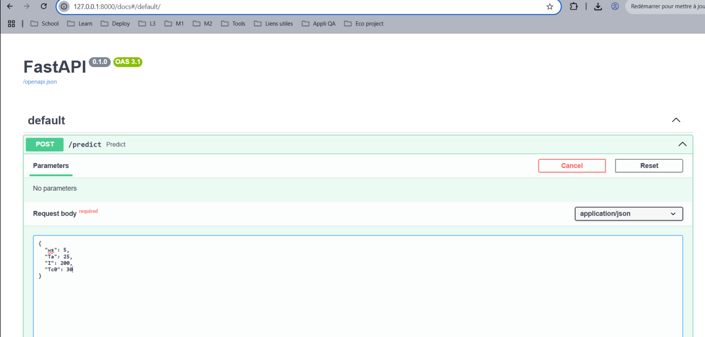
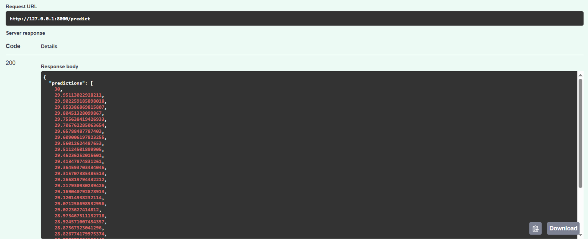
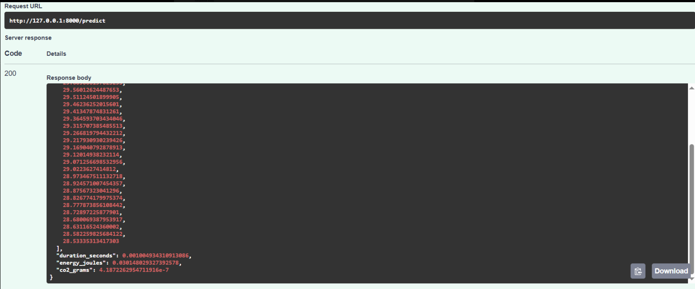
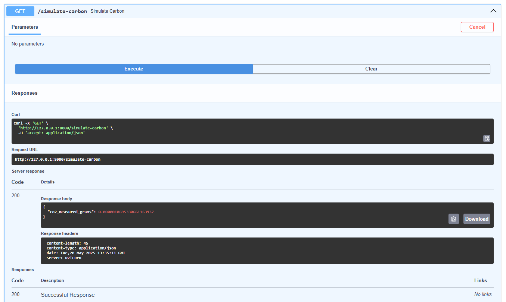

#  Documentation classique de l'API

Ce document décrit les différents **endpoints** disponibles dans l'API du projet de simulation thermique du câble. Il s'agit d'une API REST développée avec **FastAPI**, permettant :
- d'effectuer une simulation thermique sur 30 minutes ;
- d'obtenir des mesures énergétiques (durée, énergie, CO₂ estimé) ;
- de mesurer le CO₂ réel via `CodeCarbon` lors d'une opération lourde.

---

##  Endpoints disponibles

---

###  `POST /predict`

####  Description :
Permet de simuler l’évolution de la température d’un câble électrique sur une durée de **30 minutes** à partir de paramètres physiques fournis en entrée.

#### Requête attendue (body JSON) :

{
  
  "Tc0": 30,     // Température initiale du câble (°C)

  "Ta": 25,      // Température ambiante (°C)

  "ws": 2,       // Vitesse du vent (m/s)

  "I": 300       // Intensité du courant (A)

}

Réponse retournée :

{

  "predictions": [

    30.0,
    30.02123514,
    30.04523827,
    ...
  ],

  "duration_seconds": 0.0012,

  "energy_joules": 0.036,

  "co2_grams": 5.0e-07

}

Réponses retournées via FastAPI :

###  `GET /simulate-carbon`

####  Description :
Effectue une opération mathématique intensive pour mesurer les émissions réelles de CO₂ à l’aide de la bibliothèque codecarbon.

#### Requête attendue (body JSON) :

{

  "co2_measured_grams": 0.0000021

}

Cette route est utilisée pour tester le suivi carbone réel par rapport à l’estimation calculée (énergie × 50g/kWh).

