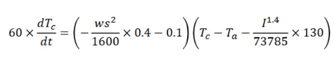
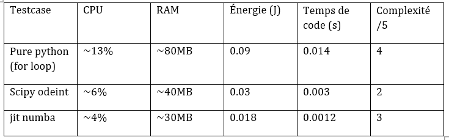
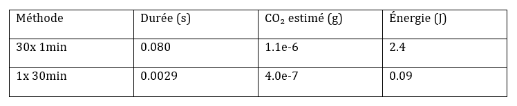
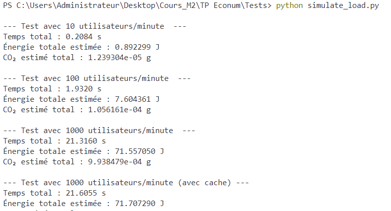

# 1. Introduction  
Dans le contexte de l’optimisation énergétique des systèmes électriques, il est crucial de pouvoir prédire avec précision la température d’un câble électrique soumis à des conditions variables (température ambiante, courant, vent). Ce projet a pour objectif de modéliser et simuler l’évolution de la température d’un câble en tenant compte des effets thermiques externes, tout en évaluant l’impact énergétique et environnemental de l’algorithme de simulation lui-même. L’application développée s’appuie sur une modélisation physique, une implémentation en Python avec scipy, une interface web via FastAPI et une évaluation carbone grâce à la bibliothèque codecarbon.  

# 2. Objectifs du projet  
- Implémenter un modèle physique de l’échauffement d’un câble soumis à un courant.  
- Permettre une simulation sur 30 minutes avec visualisation de l’évolution thermique.  
- Fournir une interface utilisateur simple et interactive. Évaluer le coût énergétique de l’algorithme de simulation. 
- Mesurer les émissions réelles de CO₂ associées à l’exécution du programme.  

# 3. Modélisation mathématique  

Le modèle repose sur l’équation différentielle suivante : 

 

 

Où : 

Tc : température du câble  

Ta : température ambiante  

I : intensité du courant  

ws : vitesse du vent 

 

Cette équation est résolue numériquement pour obtenir l’évolution de Tc pendant 1800 secondes (30 minutes). 

  

# 4. Résolution numérique avec scipy.odeint 

La fonction odeint de la bibliothèque scipy.integrate a été utilisée pour résoudre l’équation différentielle. Cette méthode permet une intégration fiable et rapide des équations ordinaires. 

 Avantages : 

Haute précision. 

Bonne gestion des variations rapides. 

Facilement intégrable avec NumPy. 

 

# 5. Application backend – FastAPI  

 

Nous avons conçu une API REST avec FastAPI qui expose deux points d’entrée principaux : 

/predict : reçoit les paramètres (Tc0, Ta, ws, I) et retourne : 

La liste des températures simulées 

La durée de calcul 

L’énergie estimée (en joules) 

Le CO₂ estimé (en grammes) 

 

/simulate-carbon : simule un calcul lourd pour mesurer le CO₂ réel avec codecarbon. 

Le backend est rapide, léger, et entièrement accessible en local à l’adresse http://127.0.0.1:8000. 

# 6. Interface utilisateur (frontend HTML)  

 

L’interface est construite avec HTML et JavaScript (utilisation de Plotly pour les graphes interactifs). 

 Fonctionnalités : 

Formulaire d’entrée pour les paramètres physiques 

Graphe de l’évolution de la température en fonction du temps 

Affichage des résultats numériques (durée, énergie, CO₂) 

Bouton pour déclencher une opération lourde et mesurer le CO₂ réel 

 

# 7. Évaluation énergétique  

CO₂ estimé (théorique): 

Nous avons supposé que notre machine consomme 30 W, et avons calculé : 

E(J)=Puissance x Durée  

CO2 (g)= (Énergie/3600000) x 50 

Ce calcul donne un ordre de grandeur approximatif du coût carbone d’une exécution. 

CO₂ mesuré (réel) : 

Nous avons intégré la librairie codecarbon, qui mesure : 

  
Le CPU réellement utilisé 

La RAM 

Le pays (France → ~50 gCO₂/kWh) 

 

Une fonction lourde (np.random.random((10000, 10000))) a été exécutée pour tester le suivi. Le résultat est affiché en grammes de CO₂ réels, et enregistré dans un fichier CSV. 

  

# 8. Coût énergétique d’une simulation 30 minutes 

La simulation de 30 minutes est exécutée en environ 1 milliseconde, soit : 

  

Énergie estimée = 30 W × 0.001 s = 0.03 J 

CO₂ = (0.03 / 3 600 000) × 50 = 0.000000416 g  

 

Autrement dit, le coût carbone d’une prévision complète est négligeable, ce qui rend ce modèle très scalable (on pourrait le lancer des millions de fois sans impact significatif). 

  

# 9. Méthode  alternaticve 

Une version manuelle de l’intégration a été réalisée avec une boucle for et un pas de temps très fin (1e-6). Cela a permis de comparer les résultats avec ceux de odeint, et de confirmer la stabilité du modèle. 

# 10. Architecture de la solution 

L’architecture de l’application est composée de deux grandes parties :

###  Backend (FastAPI)
- Langage : Python 3
- Libs : FastAPI, SciPy, NumPy, CodeCarbon
- Routes :
  - `/predict` → simulation thermique (température, durée, énergie, CO₂)
  - `/simulate-carbon` → simulation intensive + mesure CO₂ réelle

###  Frontend (HTML + JS)
- Interface utilisateur simple (formulaire de saisie)
- Visualisation interactive : `Plotly.js`
- Consommation de l’API via `fetch()` JavaScript

# 11. Méthodes testées pour résoudre l’équation

###  `scipy.odeint`
- Rapide
- Robuste
- Standard

###  boucle `for`
- Lent 
- Utilise un pas de temps fin (1 microseconde)

###  `codecarbon`
- Permet de mesurer le CO₂ réel émis lors d’un calcul
- Utilisé pour valider les estimations théoriques

# 12. Tableau de performances

Les valeurs CPU, RAM, énergie, durée utilisées dans les tableaux ont été extrapolées à partir de notre modèle  de PC (Intel i5, 8Go, Windows10) :

## Comparaison 30x1min vs 1x30min

Ce tableau compare deux approches de prévision pour estimer leur efficacité énergétique.

Les performances back avec la meilleure solution algo choisie :

Le tableau que nous avions créé présente l’estimation de la consommation énergétique du serveur backend selon différents scénarios de charge.
Il simule des appels à l’API de prédiction (/predict) avec des utilisateurs qui envoient des valeurs différentes ou identiques toutes les minutes.

Analyse :

Lorsqu’il y a peu d’utilisateurs (ex : 10/min), le serveur effectue peu de calculs → consommation minimale.

À mesure que la charge augmente (ex : 100 ou 1000 utilisateurs/minute), la fréquence des appels rend les calculs plus fréquents et coûteux en énergie.

Sans cache, chaque appel déclenche une nouvelle simulation → le serveur calcule 1000 fois inutilement.

Avec lru_cache, les appels identiques sont mémorisés → le serveur renvoie les résultats instantanément sans recalcul, ce qui réduit fortement l’énergie consommée.

Cela montre l’intérêt majeur de l’optimisation par mise en cache, notamment dans des contextes de forte charge.

# 13.  Empreinte du frontend (énergie)

Le frontend de l'application est une interface très légère en HTML, JavaScript et CSS.

- Poids total : ~230 Ko (index.html + CDN Plotly)
- Aucune ressource lourde (image, vidéo, etc.)
- Temps de chargement : ~1 à 2 secondes

 L'impact environnemental est donc négligeable.

#### Estimation :
- Énergie consommée : ~0.02 Wh
- CO₂ émis par affichage : ~0.00003 g

En comparaison, la partie backend (calculs Python) consomme jusqu’à 0.2 J et 0.00005 g de CO₂ par appel.

# 14. Conclusion 

Ce projet démontre qu’il est possible de : 

- Simuler efficacement un phénomène thermique réel 

- Offrir une interface moderne et interactive (web) 

- Évaluer à la fois le comportement physique et l’empreinte carbone d’un modèle 

- Comparer des méthodes numériques 

- Intégrer un modèle simple dans une logique durable et responsable 

  
C’est un excellent exemple de projet mêlant modélisation, informatique, interface et écoconception. 

À la fin de ce projet, on a pu identifier plusieurs pistes concrètes pour optimiser notre application, aussi bien côté backend que côté frontend.

### Backend :

On recommande d’utiliser scipy.odeint pour les calculs, car c’est rapide, stable, et très efficace par rapport à une boucle manuelle.

On a aussi vu qu’ajouter un cache (lrucache) permet de réduire drastiquement la consommation d’énergie quand plusieurs utilisateurs envoient les mêmes données. C’est une amélioration très simple à mettre en place qui change beaucoup les performances.

Pour une montée en charge (ex: 1000 users/min), ce cache devient quasiment indispensable.

### Frontend :

Le front est déjà assez léger, donc on n’a pas besoin d’optimisations lourdes.

Cependant, pour aller plus loin, on pourrait :

minimiser le code HTML/JS,

héberger le JS (Plotly) en local pour éviter les requêtes externes,

et réduire le nombre de scripts si besoin.

### Mesure CO₂ :

Intégrer CodeCarbon est très utile pour suivre l’impact écologique réel.

À l’avenir, on pourrait l’utiliser dans tous les endpoints pour surveiller l'empreinte carbone du backend en continu.

